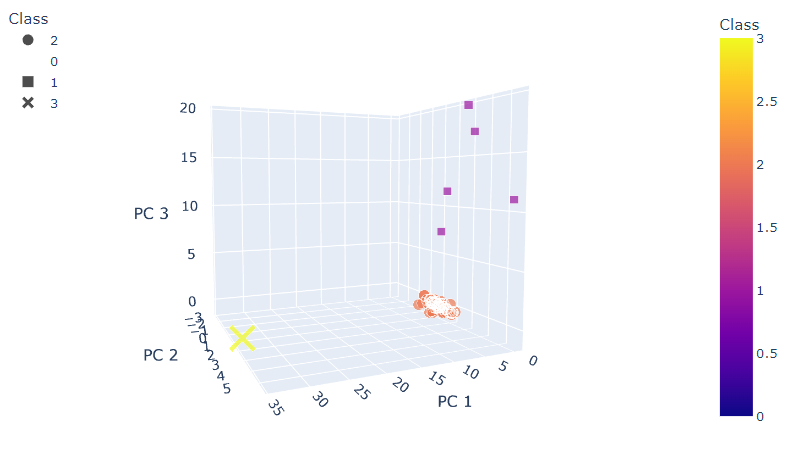
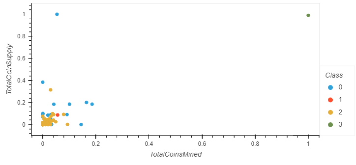

# An Analysis Assessing The Opportunities Offered By Cryptocurrencies

### *Files*:
- [crypto_clustering](crypto_clustering.ipynb)

## **Overview**:
The purpose of this data analysis was to determine the benefits of the cryptocurrency market and propose investment opportunities to a company. Due to the dramatic growth of the cryptocurrency market and the rise in popularity among investment circles, a client is interested in gathering evidence to support offering customers a cryptocurrency investment portfolio through their accounting company. Using unsupervised machine learning algorithms to highlight the trends in a dataset, the current list of cryptocurrencies were analyzed to create a model the client could use to support their proposal.

## **Results**:
The analysis included several steps for transforming the available data into a usable format for the model generating algorithms. 
1. The initial data was retrieved from a CSV file downloaded from the CryptoCompare API and converted into a Pandas DataFrame, as shown in the image below:
- starting_data](images/starting_data.png)
- This data was then reduced down to the essential factors that provided an understanding of each cryptocurrency's status in the market and details about how much importance it plays compared to the other currencies available for trading.
2. The data was then cleared of errors or corrupted data that could not be used and all data fields were converted into numerical formats for comprehension by the machine learning algorithm. Following this, a method known as Principal Component Analysis was applied to efficiently reduce the dimensions of data down to 3 main components that provided the greatest meaning for the dataset. The purpose of reducing the multiple dimensions of data down to this level is to have a model analyze the most vital parts and determine the patterns most clearly exhibited by the different values in the 3 resulting component fields from the PCA method. By identifying the clearest patterns, groupings of closely related data could be determined with the least amount of ambiguity possible in the hope those groupings could give some valuable insight into the recorded cryptocurrencies and the details relating to them.
3. Following this process of calculating relationships and attempting to reduce down the noise obscuring patterns in the data, a scatter plot was generated that presented the 3 major components along their own axes and mapped the coins according to their coordinates defined by these components. The classifications determined by the model grouped the coins and provided them each with different color coding. The resulting visualization allows for the clearest trends between the different coins to be noted, with a large amount being clustered near the low numerical values on all three dimensions, and the currencies that had the most unique characteristics being clearly shown apart from the rest, as shown in the image below:
- 
- Based on this plot, the step in separating out the cryptocurrencies from each other has been accomplished and the visualization is also able to show which coins were the outliers from the highly concentrated orange cluster, with hvplot's windows that provide the relevant data for each coin when the point is hovered over.
4. The dataset was then adjusted to provide better scaling between the different currencies based on their recorded total coin supplies and their total coins mined. The relevant data fields were then mapped on a 2D scatter plot and the visualization was generated to provide another clear representation of the patterns determined by the algorithm and the classifications provided by the resulting model. As shown in the image below, the outliers are again clearly presented compared to the other denser clusters of coins:
- 

## **Summary**:
Based on the different steps in this analysis, trends among the different currencies were clearly shown for easier comprehension by the client rather than requiring them to assess the results based on the numerical values alone. The most obvious pattern presented in both plots and in the DataFrames generated throughout the analysis was the high performance and influence the BitTorrent coin had compared to all other coins by multiple orders of magnitude. The influence on the Principal Component 1 dimension showed BitTorrent as a unique yellow X symbol among the data values, where it scored 34% of influence in the trends determined by the algorithm compared to the next highest value on that dimension of 3.69%. It also had its own class and subsequent color shade in the 2D plot as the only coin to reach a 1:1 scale of coins supplied and coins mined by traders in the market. Further trends and the meaning they represent can be found in the data with more focus and other desired conclusions to be understood by the viewer. This analysis will be very useful for the client and their proposal to their accounting firm to invest in cryptocurrencies, but the conclusions they draw are what matters most. The next step with these results is drawing conclusions that will be useful and each case will focus on different conclusions. The meanings behind the algorithm's patterns will only be useful for those that are actually applying them in some way to draw a substantial result from this analysis.
